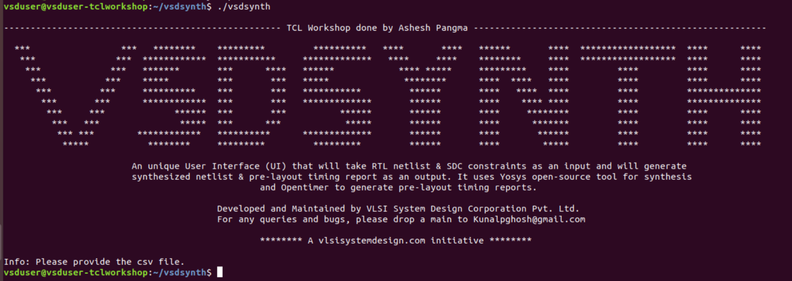
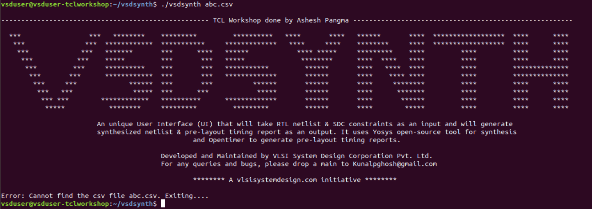
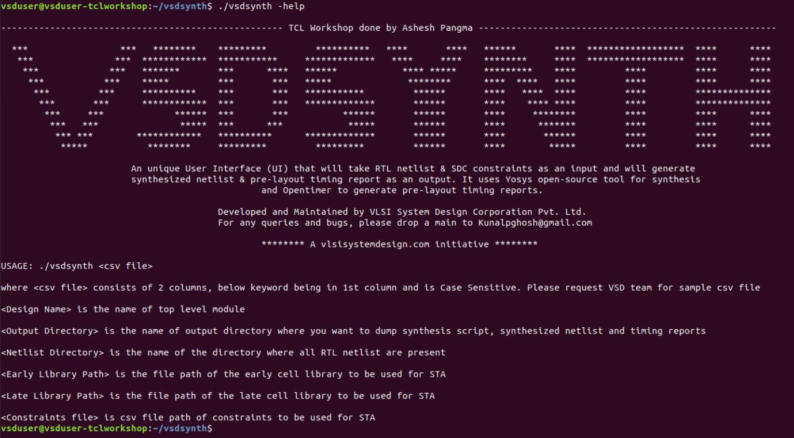
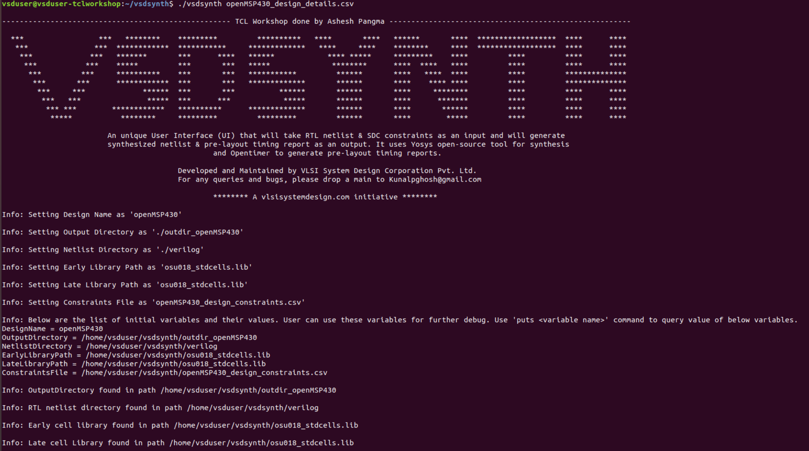
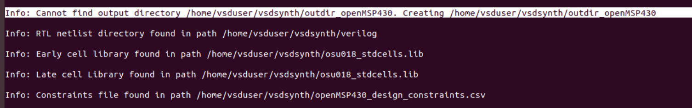

# VlSI SYSTEM DESIGN - TCL WORKSHOP

This reopository provides infomation on comprehensive 5 days TCL workshop by VLSI System Design where I learned TCL scripting techniques form basics to advanced for design and synthesis.

## Introduction

TCL stands for Tool Command Language and was created by John Ousterhout in the late 1980s. It is a dynamic scripting language and used commonly in software development, system admim, embedded system as well as in EDA(Electronic Design Automation). TCL is popular because it is simple to use, flexible and it can be integrated easily with other programming languages and tools. One of the main advantage of TCL is scripting that it greatly helps to automate tasks, build application, execute commands and manipulate data.

# Content

- [Day-1](#Day-1)
- [Day-2](#Day-2)
- [Day-3](#Day-3)
- [Day-4](#Day-4)
- [Day-5](#Day-5)

# Day-1

## Create command 'vsdsynth' 

We need to create a command 'vsdsynth' that takes .csv file as input from UNIX shell to TCL script. The command can be created using the following steps:
1. Let the system know that its a UNIX script
` #! /bin/tcsh -f `

2. Creating logo

Create a `vsdsynth` file using the command `vim vsdsynth`. Then, create a banner as shown below:
```
echo ""
echo "---------------------------------------------------- TCL Workshop done by Ashesh Pangma -------------------------------------------------------"
echo ""
echo "  ***                 ***   ********    *********         **********   ****       ****   ******       ****  ******************  ****      **** "
echo "   ***               ***  ************  ***********     *************   ****     ****    ********     ****  ******************  ****      **** "
echo "    ***             ***   *******       ***      ****   ******            **** *****     *********    ****         ****         ****      **** "
echo "     ***           ***    *****         ***       ***   *****              ********      ****  ****   ****         ****         ****      **** "
echo "      ***         ***     **********    ***       ***   ***********         ******       ****   ****  ****         ****         ************** "
echo "       ***       ***      ************  ***       ***   *************       ******       ****    **** ****         ****         ************** "
echo "        ***     ***             ******  ***       ***          ******       ******       ****     ********         ****         ****      **** "
echo "         ***   ***               *****  ***      ***            *****       ******       ****      *******         ****         ****      **** "
echo "          *** ***        ************   **********      *************       ******       ****       ******         ****         ****      **** "
echo "           *****           ********     *********         *********         ******       ****        *****         ****         ****      **** "
echo ""
echo "			An unique User Interface (UI) that will take RTL netlist & SDC constraints as an input and will generate "
echo "			synthesized netlist & pre-layout timing report as an output. It uses Yosys open-source tool for synthesis"
echo "						and Opentimer to generate pre-layout timing reports."
echo ""
echo "					Developed and Maintained by VLSI System Design Corporation Pvt. Ltd."
echo "					For any queries and bugs, please drop a main to Kunalpghosh@gmail.com"
echo ""
echo "						******** A vlsisystemdesign.com initiative ********"
echo ""
```

3. There are three general cases. 

I. The script takes an input argument which is cvs file. So, we need to check if the user has provided an argument or not. 
* The user does not provide a file or an argument


* If an argument/file is provided then we need to check if it is correct cvs file or not.



* If the user enters `-help` as argument



# Day-2






# Day-3
# Day-4
# Day-5

