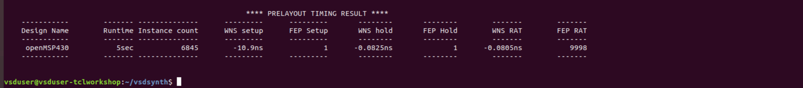

# VlSI SYSTEM DESIGN - TCL WORKSHOP

This reopository provides infomation on comprehensive 5 days TCL workshop by VLSI System Design where I learned TCL scripting techniques form basics to advanced for design and synthesis.

## Introduction

TCL stands for Tool Command Language and was created by John Ousterhout in the late 1980s. It is a dynamic scripting language and used commonly in software development, system admim, embedded system as well as in EDA(Electronic Design Automation). TCL is popular because it is simple to use, flexible and it can be integrated easily with other programming languages and tools. One of the main advantage of TCL is scripting that it greatly helps to automate tasks, build application, execute commands and manipulate data.

# Content

- [Day-1](#Day-1)
- [Day-2](#Day-2)
- [Day-3](#Day-3)
- [Day-4](#Day-4)
- [Day-5](#Day-5)

# Day-1

## Create command 'vsdsynth' 

We need to create a command 'vsdsynth' that takes .csv file as input from UNIX shell to TCL script. The command can be created using the following steps:
1. Let the system know that its a UNIX script

` #! /bin/tcsh -f `

2. Creating logo

Create a `vsdsynth` file using the command `vim vsdsynth`. Then, create a banner as shown below:
```
echo ""
echo "---------------------------------------------------- TCL Workshop done by Ashesh Pangma -------------------------------------------------------"
echo ""
echo "  ***                 ***   ********    *********         **********   ****       ****   ******       ****  ******************  ****      **** "
echo "   ***               ***  ************  ***********     *************   ****     ****    ********     ****  ******************  ****      **** "
echo "    ***             ***   *******       ***      ****   ******            **** *****     *********    ****         ****         ****      **** "
echo "     ***           ***    *****         ***       ***   *****              ********      ****  ****   ****         ****         ****      **** "
echo "      ***         ***     **********    ***       ***   ***********         ******       ****   ****  ****         ****         ************** "
echo "       ***       ***      ************  ***       ***   *************       ******       ****    **** ****         ****         ************** "
echo "        ***     ***             ******  ***       ***          ******       ******       ****     ********         ****         ****      **** "
echo "         ***   ***               *****  ***      ***            *****       ******       ****      *******         ****         ****      **** "
echo "          *** ***        ************   **********      *************       ******       ****       ******         ****         ****      **** "
echo "           *****           ********     *********         *********         ******       ****        *****         ****         ****      **** "
echo ""
echo "			An unique User Interface (UI) that will take RTL netlist & SDC constraints as an input and will generate "
echo "			synthesized netlist & pre-layout timing report as an output. It uses Yosys open-source tool for synthesis"
echo "						and Opentimer to generate pre-layout timing reports."
echo ""
echo "					Developed and Maintained by VLSI System Design Corporation Pvt. Ltd."
echo "					For any queries and bugs, please drop a main to Kunalpghosh@gmail.com"
echo ""
echo "						******** A vlsisystemdesign.com initiative ********"
echo ""
```

You can run the command by typing the following command in the prompt. 

`./vsdsynth`

NOTE: The file should be made executable by using the command `chmod -R 777 vsdsynth`

3. There are three general cases. 

I. The script takes an input argument which is cvs file. So, we need to check if the user has provided an argument or not. 
* The user does not provide a file or an argument


* If an argument/file is provided then we need to check if it is correct cvs file or not.


* If the user enters `-help` as argument


4. Finally, we need to source the Tcl script by passing the required csv file as
```
tclsh vsdsynth.tcl $argv[1]
```

# Day-2

## Create Variables
First, the csv file is converted into matrix and the variables are created. 


## Checking if the files and directories exists or not.

After the variables are created, we check if the required directory and file exists within the specified path or not. This can be seen in the following picture.


In case files are not present or found within specified path then we specify an error and stop the execution.

## Convert constraints.csv file into matrix object

Further, complex matrix processing is done to constraints.csv file to obtain various necessary informations as follows:


# Day-3

The main task for the third day is to read the provided constraints.csv file and generate a SDC file which is induatry standard format. We write TCL script to read the clock constraints as well as input constraints from the constraints.csv file and generate SDC file. 
We also had to identify bussed and non-bussed input ports before generating SDC file. For bussed ports, we add an `*` at the end of the port. The following screenshot shows that our script ran successfully.


Here, we can differentiate the bussed and non-bussed ports.


The following snipet shows the generated SDC file. We can see that the multi-bit ports has `*` at the end.


The next step includes the processing of the constraint.csv file for the output constraints.

# Day-4

Similar to processing clock and input constraints, we write a TCL script to read the output constraints from the constraints.csv file and dump it into the SDC file generated in industry standard format.


## Yosys
Yosys is an open-source RTL synthesis tool that takes RTL description as an input and generates gate-level netlist. It supports technology mapping, optimization, and formal verification. It also includes scripting interface, integrates with other EDA tools and is widely used in academia and industry for digital design tasks.

The next step is to create scripts for synthesis and running it on Yosys. Firstly, we need to check if all the hierarchy is present before we move to synthesis.
The following snippet shows hierarchy check that fails as the specified module is not found in the netlist.


We added the module to in the netlist and got our hiererchy check to pass as shown in the following snippet.


After the hirerarchy passed, we ran synthesis using Yosys with the provided netlist. As can be seen from the following snippet, synthesis ran successfully.


# Day-5

## Opentimer and Procs

Opentimer is an open-source tool developed by Tsung Wei Huan. It is used for STA analysis of the synthesized design. To generate the input file in the format accepted by OpenTimer, we made use of procs. Procs are an external tcl file that performs specific operations as described when it is sourced to the main tcl file. It is very much similar to the functions on Python programming. In this workshop, we have written several procs such as reopenStdout, read_lib, set_multi_cpu_usage, read_verilog and read_sdc. 
For example, once the proc is sourced in the main tcl script, it will be executed referring to the specific proc with provided arguments. After the execution, the main tcl script will be left with the output of the proc. Some of the procs used in this workshop are discussed below:
### 1. reopenStdout
```
proc reopenStdout {file} {
    close stdout
    open $file w       
}
```
### 2. set_num_threads
```
proc set_multi_cpu_usage {args} {
        array set options {-localCpu <num_of_threads> -help "" }
        #foreach {switch value} [array get options] {
        #puts "Option $switch is $value"
        #}
        while {[llength $args]} {
        #puts "llength is [llength $args]"
        #puts "lindex 0 of \"$args\" is [lindex $args 0]"
                switch -glob -- [lindex $args 0] {
                -localCpu {
                           #puts "old args is $args"
                           set args [lassign $args - options(-localCpu)]
                           #puts "new args is \"$args\""
                           puts "set_num_threads $options(-localCpu)"
                          }
                -help {
                           #puts "old args is $args"
                           set args [lassign $args - options(-help) ]
                           #puts "new args is \"$args\""
                           puts "Usage: set_multi_cpu_usage -localCpu <num_of_threads>"
                      }
                }
        }
}
```

### 3. read_lib
```
proc read_lib args {
	array set options {-late <late_lib_path> -early <early_lib_path> -help ""}
	while {[llength $args]} {
		switch -glob -- [lindex $args 0] {
		-late {
			set args [lassign $args - options(-late) ]
			puts "set_late_celllib_fpath $options(-late)"
		      }
		-early {
			set args [lassign $args - options(-early) ]
			puts "set_early_celllib_fpath $options(-early)"
		       }
		-help {
			set args [lassign $args - options(-help) ]
			puts "Usage: read_lib -late <late_lib_path> -early <early_lib_path>"
			puts "-late <provide late library path>"
			puts "-early <provide early library path>"
		      }	
		default break
		}
	}
}

```

### 4. read_verilog
```
proc read_verilog {arg1} {
puts "set_verilog_fpath $arg1"
}
```

### 5. read_sdc
This is a large proc and thus we discuss it in parts for better understanding and explanation. The main purpose of this proc is to convetr the SDC file into OpenTimer format.

#### 5.1 
```
proc read_sdc {arg1} {
set sdc_dirname [file dirname $arg1]
set sdc_filename [lindex [split [file tail $arg1] .] 0 ]
set sdc [open $arg1 r]
set tmp_file [open /tmp/1 w]

puts -nonewline $tmp_file [string map {"\[" "" "\]" " "} [read $sdc]]     
close $tmp_file
}
```
#### 5.2 Converting create_clock constraints
```
set tmp_file [open /tmp/1 r]
set timing_file [open /tmp/3 w]
set lines [split [read $tmp_file] "\n"]
set find_clocks [lsearch -all -inline $lines "create_clock*"]
foreach elem $find_clocks {
	set clock_port_name [lindex $elem [expr {[lsearch $elem "get_ports"]+1}]]
	set clock_period [lindex $elem [expr {[lsearch $elem "-period"]+1}]]
	set duty_cycle [expr {100 - [expr {[lindex [lindex $elem [expr {[lsearch $elem "-waveform"]+1}]] 1]*100/$clock_period}]}]
	puts $timing_file "clock $clock_port_name $clock_period $duty_cycle"
	}
close $tmp_file
```
#### 5.3 Converting set_clock_latency constraints
```
set find_keyword [lsearch -all -inline $lines "set_clock_latency*"]
set tmp2_file [open /tmp/2 w]
set new_port_name ""
foreach elem $find_keyword {
        set port_name [lindex $elem [expr {[lsearch $elem "get_clocks"]+1}]]
	if {![string match $new_port_name $port_name]} {
        	set new_port_name $port_name
        	set delays_list [lsearch -all -inline $find_keyword [join [list "*" " " $port_name " " "*"] ""]]
        	set delay_value ""
        	foreach new_elem $delays_list {
        		set port_index [lsearch $new_elem "get_clocks"]
        		lappend delay_value [lindex $new_elem [expr {$port_index-1}]]
        	}
		puts -nonewline $tmp2_file "\nat $port_name $delay_value"
	}
}

close $tmp2_file
set tmp2_file [open /tmp/2 r]
puts -nonewline $timing_file [read $tmp2_file]
close $tmp2_file
```
#### 5.4 converting set_clock_transition constraints
```
set find_keyword [lsearch -all -inline $lines "set_clock_transition*"]
set tmp2_file [open /tmp/2 w]
set new_port_name ""
foreach elem $find_keyword {
        set port_name [lindex $elem [expr {[lsearch $elem "get_clocks"]+1}]]
        if {![string match $new_port_name $port_name]} {
		set new_port_name $port_name
		set delays_list [lsearch -all -inline $find_keyword [join [list "*" " " $port_name " " "*"] ""]]
        	set delay_value ""
        	foreach new_elem $delays_list {
        		set port_index [lsearch $new_elem "get_clocks"]
        		lappend delay_value [lindex $new_elem [expr {$port_index-1}]]
        	}
        	puts -nonewline $tmp2_file "\nslew $port_name $delay_value"
	}
}

close $tmp2_file
set tmp2_file [open /tmp/2 r]
puts -nonewline $timing_file [read $tmp2_file]
close $tmp2_file
```

#### 5.5 
```t
set ot_timing_file [open $sdc_dirname/$sdc_filename.timing w]
set timing_file [open /tmp/3 r]
while {[gets $timing_file line] != -1} {
        if {[regexp -all -- {\*} $line]} {
                set bussed [lindex [lindex [split $line "*"] 0] 1]
                set final_synth_netlist [open $sdc_dirname/$sdc_filename.final.synth.v r]
                while {[gets $final_synth_netlist line2] != -1 } {
                        if {[regexp -all -- $bussed $line2] && [regexp -all -- {input} $line2] && ![string match "" $line]} {
                        puts -nonewline $ot_timing_file "\n[lindex [lindex [split $line "*"] 0 ] 0 ] [lindex [lindex [split $line2 ";"] 0 ] 1 ] [lindex [split $line "*"] 1 ]"
                        } elseif {[regexp -all -- $bussed $line2] && [regexp -all -- {output} $line2] && ![string match "" $line]} {
                        puts -nonewline $ot_timing_file "\n[lindex [lindex [split $line "*"] 0 ] 0 ] [lindex [lindex [split $line2 ";"] 0 ] 1 ] [lindex [split $line "*"] 1 ]"
                        }
                }
        } else {
        puts -nonewline $ot_timing_file  "\n$line"
        }
}

close $timing_file
puts "set_timing_fpath $sdc_dirname/$sdc_filename.timing"
```

The output of the read_sdc proc is the timing file which is shown by the following snippet. This is the required Opentimer format.


All the procs need to be sourced so that they can be called in the main file. 


